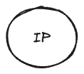
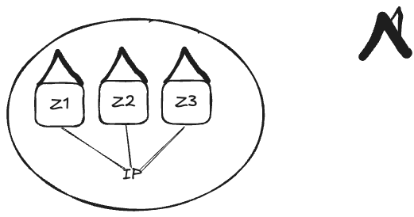
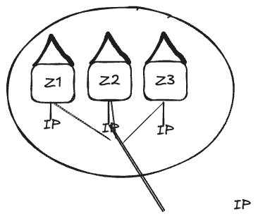

# Virtual Networks

## Explore Virtual Networks

- Can use the same or overlapping space, however this will interfere with the ability communicate/route between VNets.
- Must be peered to communicate with each other.
	- Regional peering occurs across VNets
	- Global peering
	- Peering is non-transitive - must have a direct peering to communicate between VNets
	- Free to peer, however data out is charged
	- Can create trust relationships
	- Can peer across Resource Groups, Subscriptions, and Tenants
	- Can peer classic VNets to ARM VNets
	- Routes vai Azure backbone, meaning Private and Isolated
	- Not encrypted by default (Must enable)

### Azure Reserved Subnet IP Addresses

Azure reserves specific IP addresses within each subnet for internal use. These reserved addresses cannot be assigned to resources.

| Reserved IP Address | Purpose                                                                 |
|---------------------|-------------------------------------------------------------------------|
| **First IP Address** (e.g., `x.x.x.0`) | Network address. Used to identify the subnet itself.                     |
| **Second IP Address** (e.g., `x.x.x.1`) | Reserved for the default gateway for the subnet.                        |
| **Third IP Address** (e.g., `x.x.x.2`)  | Reserved for Azure DNS.                                                  |
| **Fourth IP Address** (e.g., `x.x.x.3`) | Reserved for future use.                                                 |
| **Last IP Address** (e.g., `x.x.x.255`) | Broadcast address. Not used in Azure but reserved for compatibility.     |

#### Notes:
- Azure reserves **5 IP addresses** in each subnet, regardless of its size.
- These reserved addresses reduce the total number of usable IP addresses in a subnet.
- When designing subnets, ensure that the subnet size accounts for these reserved addresses.

For more details, refer to the official documentation:  
[Azure Reserved IP Addresses](https://learn.microsoft.com/en-us/azure/virtual-network/virtual-network-ip-addresses-overview#subnet-size-considerations)

### Unavailable Azure IP Addresses

Azure reserves specific IP address ranges that are not available for use in any Azure deployment. These ranges are reserved for internal Azure operations and cannot be assigned to resources.

| Reserved IP Address Range       | Purpose                                                                 |
|---------------------------------|-------------------------------------------------------------------------|
| **168.63.129.16/32**            | Used by Azure for internal platform services, such as DNS and health probes. |
| **224.0.0.0/4**                 | Reserved for multicast traffic. Not supported in Azure.                |
| **255.255.255.255**             | Reserved for broadcast traffic. Not supported in Azure.                |
| **127.0.0.0/8**                 | Reserved for loopback addresses. Not routable in Azure.                |
| **169.254.0.0/16**              | Reserved for link-local addresses. Used for automatic private IP addressing (APIPA). |
| **0.0.0.0/8**                   | Reserved for broadcast purposes. Not routable in Azure.                |

#### Notes:
- These IP address ranges are reserved globally and cannot be used in any Azure Virtual Network or subnet.
- The **168.63.129.16/32** address is specifically used by Azure for platform-level services, such as:
  - **DNS**: Azure-provided DNS resolution.
  - **Health Probes**: For load balancer health monitoring.
  - **Time Synchronization**: For Azure VMs.

For more details, refer to the official documentation:  
[Azure Reserved IP Ranges](https://learn.microsoft.com/en-us/azure/virtual-network/reserved-ip-addresses)

## Configure public IP services

Azure public IP addresses can be deployed with different zone configurations to provide varying levels of availability and resiliency. The following table explains the differences between **No Zone**, **Zone-Redundant**, and **Zonal** public IPs:

| Zone Type           | Description                                                                 | Use Case                                                                 |
|---------------------|-----------------------------------------------------------------------------|-------------------------------------------------------------------------|
| **No Zone**         | The public IP is not associated with any specific availability zone. Azure automatically assigns the IP to a zone. | Suitable for non-critical workloads where zone resiliency is not required. |
| **Zone-Redundant**  | The public IP is replicated across multiple availability zones, ensuring high availability. | Ideal for production workloads requiring high availability and resiliency. |
| **Zonal**           | The public IP is tied to a specific availability zone, ensuring that the IP is only available in that zone. | Suitable for workloads requiring zone-specific deployment for latency or compliance. |

### Key Features of Zone Types:

- **No Zone**:
  - Azure automatically assigns the public IP to a zone.
  - Provides basic availability without explicit zone control.
  - Supported in both **Basic** and **Standard** SKUs.

- **Zone-Redundant**:
  - Ensures resiliency by replicating the public IP across multiple zones.
  - Supported only in the **Standard** SKU.
  - Provides higher availability for mission-critical workloads.

- **Zonal**:
  - The public IP is tied to a specific zone (e.g., Zone 1, Zone 2, or Zone 3).
  - Provides control over the zone placement of resources.
  - Supported only in the **Standard** SKU.

### Notes:
- **Zone-Redundant and Zonal IPs** are only available in regions that support availability zones.
- **Standard SKU** is required for both Zone-Redundant and Zonal public IPs.
- When designing for high availability, consider using Zone-Redundant public IPs to ensure resiliency across zones.

For more details, refer to the official documentation:  
[Azure Public IP Address Zones](https://learn.microsoft.com/en-us/azure/virtual-network/public-ip-addresses#availability-zones)

### Public IP SKUs: Basic vs Standard

Azure provides two SKUs for public IP addresses: **Basic** and **Standard**. The following table compares their features:

| Feature                          | Basic Public IP SKU                        | Standard Public IP SKU                     |
|----------------------------------|--------------------------------------------|--------------------------------------------|
| **Availability Zone Support**    | Not supported                              | Supported (Zone-redundant or zonal).       |
| **Load Balancer Compatibility**  | Basic Load Balancer only                   | Standard Load Balancer only.               |
| **Secure by Default**            | Not secure by default (open to all traffic). | Secure by default (requires NSG or firewall rules). |
| **Static/Dynamic Allocation**    | Supports both static and dynamic allocation. | Static allocation only.                    |
| **Routing Preference**           | Not supported                              | Supported (Internet or Microsoft network). |
| **DNS Label**                    | Supported                                  | Supported                                  |
| **Pricing**                      | Lower cost                                 | Higher cost                                |
| **Use Case**                     | Suitable for non-critical workloads or testing. | Suitable for production workloads requiring high availability and security. |
| **End Creation Date**            | 03/21/2025                                 | N/A                                        |
| **Retirement Date**              | 09/20/2025                                 | N/A                                        |

### Notes:
- **Availability Zone Support**: Standard SKU supports zone-redundant or zonal deployments for higher availability.
- **Secure by Default**: Standard SKU requires explicit rules (e.g., NSGs or firewalls) to allow traffic, enhancing security.
- **Routing Preference**: Standard SKU allows you to choose between routing traffic over the Microsoft global network or the public internet.

For more details, refer to the official documentation:  
[Azure Public IP Address SKUs](https://learn.microsoft.com/en-us/azure/virtual-network/public-ip-addresses#sku)

### Azure Bring Your Own IP (BYOIP)

Azure **Bring Your Own IP (BYOIP)** allows you to bring your own public IP address ranges to Azure and use them with your Azure resources. This feature is particularly useful for organizations that want to maintain their existing IP address ranges for continuity, compliance, or branding purposes.

#### Key Features:
- Use your own public IP address ranges in Azure.
- Maintain IP address ownership while leveraging Azure's global infrastructure.
- Ensure seamless migration of workloads to Azure without changing IP addresses.
- Supported for both IPv4 and IPv6 address ranges.

#### Three Phases to Register BYOIP

The process of registering and using your own IP address ranges in Azure involves three main phases:

| Phase               | Description                                                                 |
|---------------------|-----------------------------------------------------------------------------|
| **1. Validation**   | Azure validates that you own the IP address range by verifying ownership through the Regional Internet Registry (RIR). You must create a Letter of Authorization (LOA) and provide it to Azure. |
| **2. Provisioning** | After validation, Azure provisions the IP address range in its infrastructure. This step ensures that the IP range is ready to be used with Azure resources. |
| **3. Enablement**   | Once provisioning is complete, you can enable the IP address range for use with Azure services, such as Virtual Networks, Load Balancers, and Application Gateways. |

#### Notes:
- BYOIP is supported in specific Azure regions. Ensure that your region supports this feature before proceeding.
- The IP address range must not be advertised on the internet while it is being provisioned in Azure.
- You retain ownership of the IP address range and can withdraw it from Azure if needed.

For more details, refer to the official documentation:  
[Azure Bring Your Own IP (BYOIP)](https://learn.microsoft.com/en-us/azure/virtual-network/byoip)

## Design name resolution for your virtual network

## Enable cross-virtual network connectivity with peering

## Implement virtual network traffic routing

## Configure intern access with Azure Virtual NAT

## Appendix

### RFC1918 Address Spaces with Subnets

The following table lists the private IP address ranges defined by **RFC1918** and their corresponding subnet masks:

| Address Range       | CIDR Notation   | Subnet Mask       | Number of Addresses | Common Use Case                     |
|---------------------|-----------------|-------------------|---------------------|-------------------------------------|
| 10.0.0.0 - 10.255.255.255 | 10.0.0.0/8     | 255.0.0.0         | ~16.7 million       | Large private networks              |
| 172.16.0.0 - 172.31.255.255 | 172.16.0.0/12  | 255.240.0.0       | ~1 million          | Medium-sized private networks       |
| 192.168.0.0 - 192.168.255.255 | 192.168.0.0/16 | 255.255.0.0       | ~65,536             | Small private networks (home, SMBs) |

### Notes:
- **CIDR Notation**: Represents the range of IP addresses using a prefix length.
- **Subnet Mask**: Defines the division between the network and host portions of the address.
- **Number of Addresses**: Indicates the total number of usable IP addresses in the range.

These address spaces are reserved for private use and are not routable on the public internet. They are commonly used in Azure Virtual Networks (VNets) for internal communication.

For more details, refer to the official documentation:  
[RFC1918 Address Allocation](https://tools.ietf.org/html/rfc1918)

## Azure Reserved Subnet IP Addresses

Azure reserves specific IP addresses within each subnet for internal use. These reserved addresses cannot be assigned to resources.

| Reserved IP Address | Purpose                                                                 |
|---------------------|-------------------------------------------------------------------------|
| **First IP Address** (e.g., `x.x.x.0`) | Network address. Used to identify the subnet itself.                     |
| **Second IP Address** (e.g., `x.x.x.1`) | Reserved for the default gateway for the subnet.                        |
| **Third IP Address** (e.g., `x.x.x.2`)  | Reserved for Azure DNS.                                                  |
| **Fourth IP Address** (e.g., `x.x.x.3`) | Reserved for future use.                                                 |
| **Last IP Address** (e.g., `x.x.x.255`) | Broadcast address. Not used in Azure but reserved for compatibility.     |

### Notes:
- Azure reserves **5 IP addresses** in each subnet, regardless of its size.
- These reserved addresses reduce the total number of usable IP addresses in a subnet.
- When designing subnets, ensure that the subnet size accounts for these reserved addresses.

For more details, refer to the official documentation:  
[Azure Reserved IP Addresses](https://learn.microsoft.com/en-us/azure/virtual-network/virtual-network-ip-addresses-overview#subnet-size-considerations)

## Unavailable Azure IP Addresses

Azure reserves specific IP address ranges that are not available for use in any Azure deployment. These ranges are reserved for internal Azure operations and cannot be assigned to resources.

| Reserved IP Address Range       | Purpose                                                                 |
|---------------------------------|-------------------------------------------------------------------------|
| **168.63.129.16/32**            | Used by Azure for internal platform services, such as DNS and health probes. |
| **224.0.0.0/4**                 | Reserved for multicast traffic. Not supported in Azure.                |
| **255.255.255.255**             | Reserved for broadcast traffic. Not supported in Azure.                |
| **127.0.0.0/8**                 | Reserved for loopback addresses. Not routable in Azure.                |
| **169.254.0.0/16**              | Reserved for link-local addresses. Used for automatic private IP addressing (APIPA). |
| **0.0.0.0/8**                   | Reserved for broadcast purposes. Not routable in Azure.                |

### Notes:
- These IP address ranges are reserved globally and cannot be used in any Azure Virtual Network or subnet.
- The **168.63.129.16/32** address is specifically used by Azure for platform-level services, such as:
  - **DNS**: Azure-provided DNS resolution.
  - **Health Probes**: For load balancer health monitoring.
  - **Time Synchronization**: For Azure VMs.

For more details, refer to the official documentation:  
[Azure Reserved IP Ranges](https://learn.microsoft.com/en-us/azure/virtual-network/reserved-ip-addresses)

